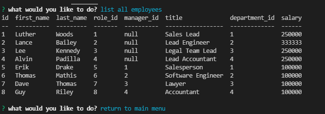

# Employee Management System

## Description

A node application that makes use of a MySql database and various npm packages to allow employers to keep record of employees.
    
## https://github.com/lancebailey26/employeeManager
## https://www.youtube.com/watch?v=B5WuAEDD4sI

## Installation

npm install to install various dependencies, then use the provided MySql schema and seed files in the db folder to add example data, and apply your MySql username and password to the connection area (server.js lines 9+10).

## Usage

Run the app in your terminal, then follow the various prompts to update your employee database.

## Credits

n/a

## Copyright Lance Bailey 7/26/2021 License: MIT License